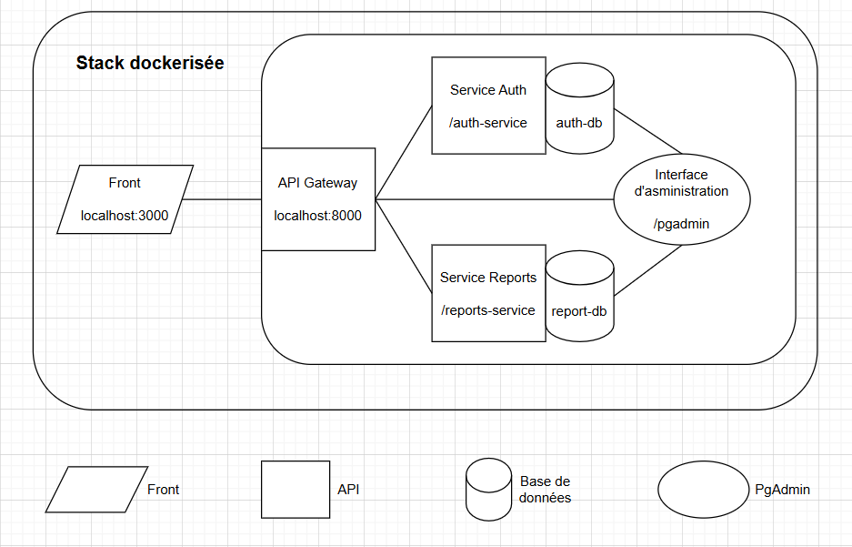

# 🧱 Healthstack

## Explication de Projet

Le projet a pour objectif de développer une plateforme de gestion de rapports médicaux accessible via une interface web.
Cette solution est destinée à faciliter le suivi médical des patients, tout en garantissant la sécurité et la confidentialité des données de santé.

Trois types d’utilisateurs interagissent avec la plateforme :

Les médecins peuvent se connecter à leur espace sécurisé afin de créer, modifier, consulter et archiver des rapports médicaux pour les patients qu’ils suivent. Ils disposent d’un accès complet aux informations nécessaires à la prise en charge médicale.

Les patients disposent d’un accès restreint à leur propre espace personnel, depuis lequel ils peuvent consulter uniquement leurs propres rapports médicaux. Cela leur permet de suivre l’évolution de leur état de santé et de conserver un historique numérique de leurs consultations.

L’administrateur a un rôle de gestion du système. Il est responsable de la création des comptes utilisateurs et de leur affectation à un groupe d’accès : médecin ou patient. Il ne consulte pas les rapports médicaux, mais s’assure du bon fonctionnement de la plateforme et de la gestion des droits d’accès.

L’ensemble du système repose sur une architecture modulaire et sécurisée, permettant une évolutivité facile. Chaque utilisateur interagit avec la plateforme selon les droits qui lui sont attribués, et les données sont stockées de manière structurée pour assurer leur intégrité et leur confidentialité.

La stack est composée de plusieurs microservices conteneurisés avec Docker.
Elle inclut une interface front-end, une API Gateway,
des services métiers (`auth` et `reports`),
deux bases de données PostgreSQL,
ainsi qu'une interface d’administration via pgAdmin.

### Fonctionnalités principales
- Les médecins peuvent créer, modifier, consulter et archiver des rapports médicaux, et accéder à l’historique des patients.
- Les patients consultent uniquement leurs propres rapports dans un espace personnel sécurisé.
- Le service auth-service gère la création de comptes, la connexion, la déconnexion et l’attribution des rôles.
- Le service reports-service permet la gestion complète des rapports (création, lecture, mise à jour, suppression).
- L’interface d’administration permet de superviser la plateforme et gérer les comptes en garantissant la sécurité des données.


---

## 🚀 Lancer le projet

```bash
docker network create --driver bridge app-network
docker-compose up --build
```

Ensuite, accédez à :

- Frontend : http://localhost:3000
- Service Auth : http://localhost:8000/auth
- Service Reports : http://localhost:8000/reports
- PgAdmin : http://localhost:8000/pgadmin

---

## 📐 Architecture



---

## 🧩 Services

| Service         | Description                | Port interne | Exposé ? | Adresse d'accès                        |
|----------------|----------------------------|--------------|----------|----------------------------------------|
| `app-front`     | Frontend React             | 3000         | ✅       | http://localhost:3000                  |
| `gateway`       | API Gateway Express        | 8000         | ✅       | http://localhost:8000                  |
| `auth-service`  | Authentification, login, register | 8001         | ❌       | via gateway → `/auth`                  |
| `reports-service`| Génération et accès aux rapports | 8002         | ❌       | via gateway → `/reports`               |
| `auth-db`       | Base PostgreSQL de `auth-service` | 5432         | ❌       | Accessible uniquement en réseau Docker |
| `report-db`     | Base PostgreSQL de `reports-service` | 5432         | ❌       | Accessible uniquement en réseau Docker |
| `pgadmin`       | Interface admin PostgreSQL | 80           | ❌       | via gateway → `/pgadmin`               |

---

## 🌐 Accès via API Gateway

Toutes les routes publiques passent par le **Gateway (localhost:8000)** :

- `GET /auth/...` → vers `auth-service`
- `GET /reports/...` → vers `reports-service`
- `GET /pgadmin` → interface pgAdmin reverse proxy

> 🔒 Auth et gestion de quotas sont activables via les configs de route dans `routes.js`.

---

## 🗃️ Compte pgAdmin (par défaut)

- **Email :** `admin@example.com`
- **Password :** `admin`

**PgAdmin** est automatiquement configuré avec les infos des différentes
bases de données grâce au fichier de config **servers.json** (pgadmin/**servers.json**)

---

## 📁 Fichiers importants

- `docker-compose.yml` : Orchestration des services
- `gateway/routes.js` : Configuration des routes proxy
- `pgadmin/servers.json` : Configuration PgAdmin

---

## ⚙️ Explication Choix techniques
L’architecture Healthstack repose sur une approche moderne orientée microservices, permettant de découpler les responsabilités fonctionnelles (authentification, gestion de rapports médicaux) dans des services indépendants. Ce choix favorise plusieurs avantages cruciaux pour un projet évolutif :

## 🔁 Séparation des responsabilités
Chaque microservice gère un domaine métier spécifique :

auth-service gère l’inscription, l’authentification et la gestion des tokens.

reports-service gère la création, la lecture et le stockage des rapports médicaux.

Cela garantit un code plus lisible, des cycles de développement plus rapides, et une meilleure testabilité. De plus, chaque service peut être mis à jour ou redéployé sans impacter les autres.

### 🐳 Conteneurisation avec Docker
Tous les services sont conteneurisés via Docker, ce qui garantit :

Une isolation des services, évitant les conflits de dépendances.

Une portabilité accrue, que ce soit en local ou sur un cloud provider.

L’orchestration se fait via docker-compose, qui simplifie le démarrage des services, la création du réseau privé Docker (app-network), et la gestion des volumes (pour persister les données PostgreSQL).

### 🌉 API Gateway
Le gateway joue un rôle central. Il agit comme reverse proxy vers les microservices backend :

Il unifie les points d’accès vers les services (/auth, /reports, /pgadmin).

Il simplifie la sécurisation et la surveillance, car toutes les requêtes passent par un seul point.

Ce design permet aussi de masquer les ports internes non exposés (8001, 8002) et de ne laisser qu’un seul port public (8000).

### 🛢️ Bases de données PostgreSQL dédiées
Chaque service possède sa propre base de données PostgreSQL :

auth-db pour la gestion des utilisateurs, tokens, etc.

report-db pour les rapports médicaux.

Cela respecte le principe Database-per-service, ce qui garantit l’indépendance des services, une meilleure sécurité (accès restreint), et facilite l’évolution indépendante du schéma de chaque base.

### 🖥️ Interface d’administration PgAdmin
PgAdmin est intégré dans la stack pour faciliter le debugging, l’audit des données, et la gestion manuelle des bases en phase de développement. Il est accessible via la route /pgadmin du gateway et automatiquement préconfiguré avec les connexions aux bases via le fichier servers.json.

### 🔐 Sécurité et extensibilité
Le design est pensé pour intégrer facilement des mécanismes de sécurité :

Middleware d’authentification dans le gateway pour protéger les routes sensibles.

Possibilité d’ajouter des vérifications JWT ou OAuth2.

Mise en place future possible de rate-limiting ou d’analyse de logs centralisée.

### 🧱 Frontend React
Le front-end, exposé sur localhost:3000, communique exclusivement via l’API Gateway. Cela permet de changer l’implémentation backend sans impacter l’interface utilisateur, et de centraliser tous les appels API.


## Back end apis

### auth-service

POST `http://localhost:8000/auth/users/login`
GET  `http://localhost:8000/auth/users/logout`
GET  `http://localhost:8000/auth/users/`
POST `http://localhost:8000/auth/users/signup`
GET `http://localhost:8000/auth/users/patients`
GET `http://localhost:8000/auth/users/name/:id`

GET  `http://localhost:8000/auth/api-docs/`

### reports-service

GET     `http://localhost:8000/reports/`
GET     `http://localhost:8000/reports/doctor`
GET     `http://localhost:8000/reports/patient`
GET     `http://localhost:8000/reports/:id`
POST    `http://localhost:8000/reports/`
PUT     `http://localhost:8000/reports/:id`
DELETE  `http://localhost:8000/reports/:id`

GET `http://localhost:8000/reports/api-docs/`
