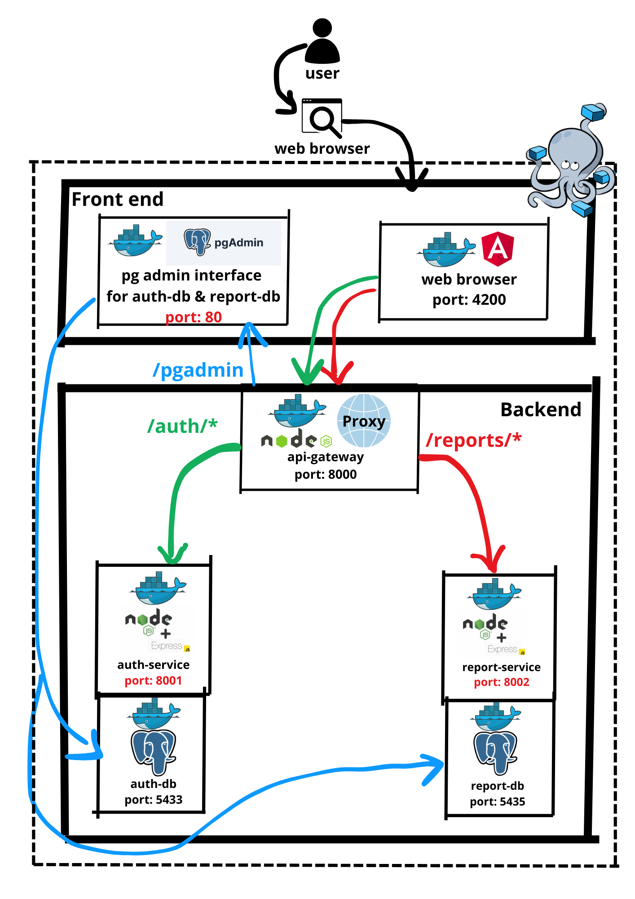

# 🧱 Healthstack
Le but de cette application est de donner la possibilité aux médecins et aux patients
de consulter facilement des rapports médicaux.

La stack est composée de plusieurs microservices conteneurisés avec Docker.
Elle inclut une interface front-end, une API Gateway,
des services métiers (`auth` et `reports`), 
deux bases de données PostgreSQL,
ainsi qu'une interface d’administration via pgAdmin.

---

## 📐 Architecture



---

## 🧩 Services

| Service         | Description                | Port interne | Exposé ? | Adresse d'accès                        |
|----------------|----------------------------|--------------|----------|----------------------------------------|
| `app-front`     | Frontend React             | 3000         | ✅       | http://localhost:3000                  |
| `gateway`       | API Gateway Express        | 8000         | ✅       | http://localhost:8000                  |
| `auth-service`  | Authentification, login, register | 8001         | ❌       | via gateway → `/auth`                  |
| `reports-service`| Génération et accès aux rapports | 8002         | ❌       | via gateway → `/reports`               |
| `auth-db`       | Base PostgreSQL de `auth-service` | 5432         | ❌       | Accessible uniquement en réseau Docker |
| `report-db`     | Base PostgreSQL de `reports-service` | 5432         | ❌       | Accessible uniquement en réseau Docker |
| `pgadmin`       | Interface admin PostgreSQL | 80           | ❌       | via gateway → `/pgadmin`               |

---

## 🌐 Accès via API Gateway

Toutes les routes publiques passent par le **Gateway (localhost:8000)** :

- `GET /auth/...` → vers `auth-service`
- `GET /reports/...` → vers `reports-service`
- `GET /pgadmin` → interface pgAdmin reverse proxy

> 🔒 Auth et gestion de quotas sont activables via les configs de route dans `routes.js`.

---

## 🚀 Lancer le projet

```bash
docker network create --driver bridge app-network
docker-compose up --build
```

Ensuite, accédez à :

- Frontend : http://localhost:3000
- Service Auth : http://localhost:8000/auth
- Service Reports : http://localhost:8000/reports
- PgAdmin : http://localhost:8000/pgadmin

---

## 🗃️ Compte pgAdmin (par défaut)

- **Email :** `admin@example.com`
- **Password :** `admin`

**PgAdmin** est automatiquement configuré avec les infos des différentes
bases de données grâce au fichier de config **servers.json** (pgadmin/**servers.json**)

---

## 📁 Fichiers importants

- `docker-compose.yml` : Orchestration des services
- `gateway/routes.js` : Configuration des routes proxy
- `pgadmin/servers.json` : Configuration PgAdmin

---